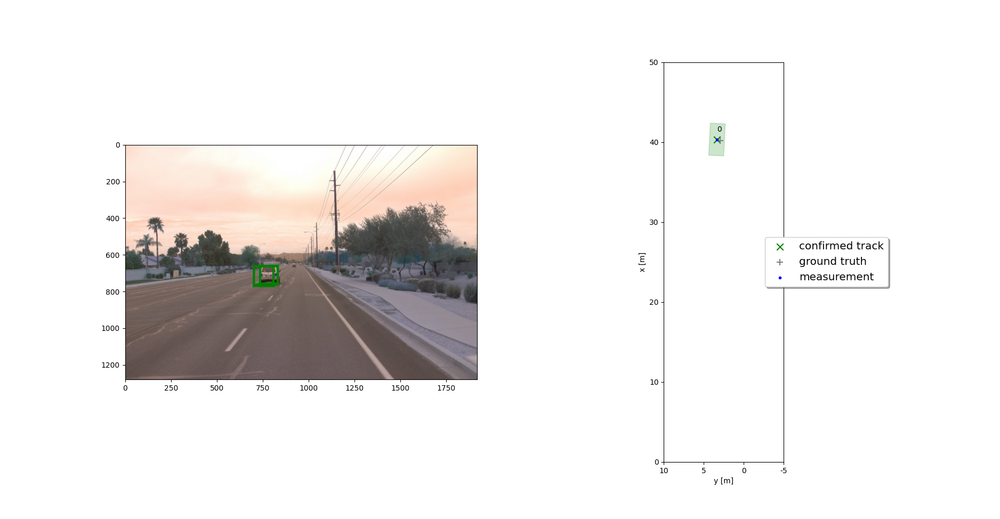
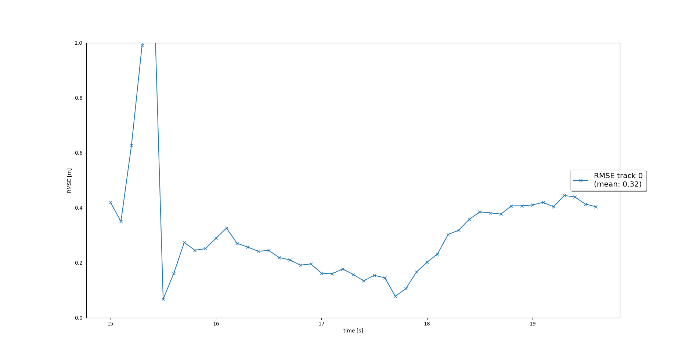
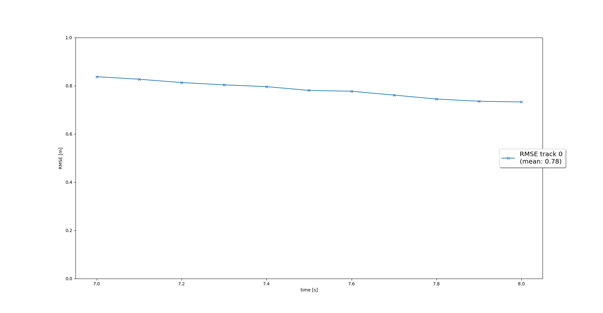
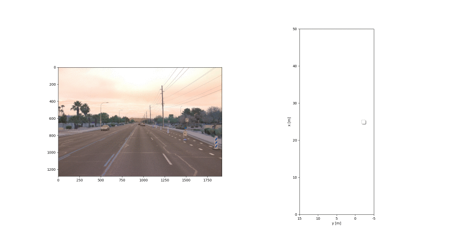
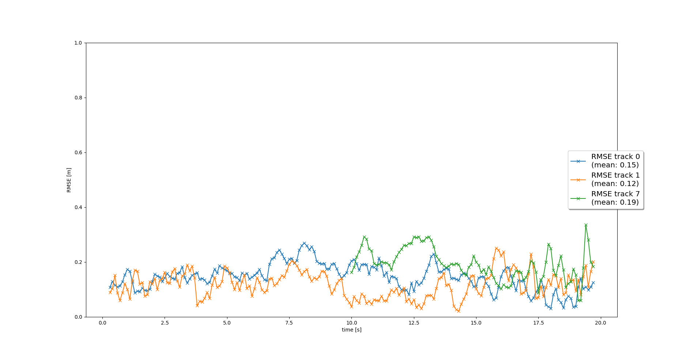
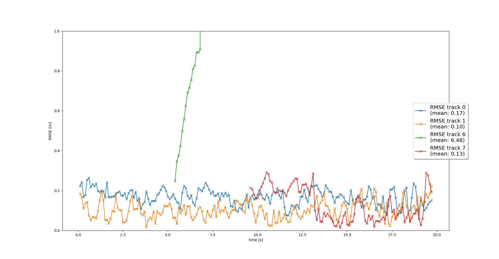

# FINAL PROJECT

## DEV. STEPS
### STEP 1

On this overview image, we can see the output of the EKF following the ground truth quite closely for one single object.

The RMSE is smaller than 0.35 as expected in the project specifications.


### STEP 2
Here are the last comments from the terminal where loop_over_dataset.py has been executed.
We can notice that at frame #97 the track 0 is deleted.Indeed this is where the localization uncertainty is getting too hight (P[0,0] and P[1,1] > params.max_P)
```
processing frame #96
loading lidar point-cloud from result file
loading birds-eve view from result file
loading detected objects from result file
loading object labels and validation from result file
loading detection performance measures from file
predict track 0
track 0 score = 1.0
track 0 score = 1.0
------------------------------
processing frame #97
loading lidar point-cloud from result file
loading birds-eve view from result file
loading detected objects from result file
loading object labels and validation from result file
loading detection performance measures from file
predict track 0
deleting track no. 0
------------------------------
processing frame #98
loading lidar point-cloud from result file
loading birds-eve view from result file
loading detected objects from result file
loading object labels and validation from result file
loading detection performance measures from file
------------------------------
processing frame #99
loading lidar point-cloud from result file
loading birds-eve view from result file
loading detected objects from result file
loading object labels and validation from result file
loading detection performance measures from file
------------------------------
processing frame #100
loading lidar point-cloud from result file
loading birds-eve view from result file
loading detected objects from result file
loading object labels and validation from result file
loading detection performance measures from file
reached end of selected frames
```


The RMSE is near a flat line around 0.8 as expected.


On this animation, you can see the track changing it state (including the quick confirmation) and the deletion.

### STEP 3
Here are the last log of the Python console :
```
processing frame #175
loading lidar point-cloud from result file
loading birds-eve view from result file
loading detected objects from result file
loading object labels and validation from result file
loading detection performance measures from file
predict track 0
predict track 1
predict track 7
update track 1 with lidar measurement 1
update track 0 with lidar measurement 0
update track 7 with lidar measurement 2
track 0 score = 1.0
track 1 score = 1.0
track 7 score = 1.0
track 0 score = 1.0
track 1 score = 1.0
track 7 score = 1.0
------------------------------
processing frame #176
loading lidar point-cloud from result file
loading birds-eve view from result file
loading detected objects from result file
loading object labels and validation from result file
loading detection performance measures from file
predict track 0
predict track 1
predict track 7
update track 0 with lidar measurement 2
update track 1 with lidar measurement 1
update track 7 with lidar measurement 0
track 0 score = 1.0
track 1 score = 1.0
track 7 score = 1.0
track 0 score = 1.0
track 1 score = 1.0
track 7 score = 1.0
------------------------------
processing frame #177
loading lidar point-cloud from result file
loading birds-eve view from result file
loading detected objects from result file
loading object labels and validation from result file
loading detection performance measures from file
predict track 0
predict track 1
predict track 7
update track 0 with lidar measurement 2
update track 7 with lidar measurement 0
update track 1 with lidar measurement 1
track 0 score = 1.0
track 1 score = 1.0
track 7 score = 1.0
track 0 score = 1.0
track 1 score = 1.0
track 7 score = 1.0
------------------------------
processing frame #178
loading lidar point-cloud from result file
loading birds-eve view from result file
loading detected objects from result file
loading object labels and validation from result file
loading detection performance measures from file
predict track 0
predict track 1
predict track 7
update track 0 with lidar measurement 0
update track 7 with lidar measurement 1
update track 1 with lidar measurement 2
track 0 score = 1.0
track 1 score = 1.0
track 7 score = 1.0
track 0 score = 1.0
track 1 score = 1.0
track 7 score = 1.0
------------------------------
processing frame #179
loading lidar point-cloud from result file
loading birds-eve view from result file
loading detected objects from result file
loading object labels and validation from result file
loading detection performance measures from file
predict track 0
predict track 1
predict track 7
update track 7 with lidar measurement 2
update track 0 with lidar measurement 0
update track 1 with lidar measurement 1
track 0 score = 1.0
track 1 score = 1.0
track 7 score = 1.0
track 0 score = 1.0
track 1 score = 1.0
track 7 score = 1.0
```
This shows that each measurement is used at most once and updated at most once.


The animation shows that 'ghost track' never achieve the 'confirmed' state.


We have fairly low RMSE values for the 3 'confirmed' tracks.

### STEP 4
An AVI movie is available in this folder (STEP 4.avi).
The animation shows that 'ghost track' never achieve the 'confirmed' state. 
2 vehicules are 'confirmed' from the begin to the end of the sequence. Tracks are never lost.
A third stable track appears in the middle of the sequence. Once it is confirmed, it is never lost.
One last vehicule is tracked for a few seconds but it is too far away to be stable.



We have fairly low RMSE values for the 3 'confirmed' tracks.
For the 2 stable tracks, RMSE is below 0.25 (0.17 and 0.10).

## OTHER QUESTIONS
### 2. Do you see any benefits in camera-lidar fusion compared to lidar-only tracking (in theory and in your concrete results)? 
Using the 2 sensors do not necessarily lead to a better acquiration of the positionning. For track 0, the RMSE is a letter higher with lidar and camera datas than with lidar alone. This is the opposite for the track 1.
But it leads to a smaller uncertainty of the positionning.
Without the camera, the 'far away" vehicule track never achieve the 'confirmed' state. It can be great to have a detection at higher distances.

### 3. Which challenges will a sensor fusion system face in real-life scenarios? Did you see any of these challenges in the project?
I think that getting the system to work in real time is a big challenge. We did not address this point at all in the course (or just with the gating strategy).

A better association alogrithm also seems important to me. We have seen in the course some of the biasis related to the SNN.

Although you state that sensor uncertainty data is usually provided for manufacturers, my experience is that this is not always the case. I have developed a UKF for a mobile robot and the job of setting up the UKF is not so trivial.

Managing the flow of incoming data may not be simple either. There may be time lags between transmit and receive times and not all sensors send time-stamped messages. Sometimes it is the middleware that receives the stamped stream. It may be necessary to create message stacks so that it is not always the same sensor that triggers the prediction and update. This was made very simple in this project...

### 4. Can you think of ways to improve your tracking results in the future?
There are different ways :
   - moving from the SNN to a probabilistic strategy.
   - replacing the simple constant velocity motion model for a CTRV model or even more complex CTRA model.
   - enrich with other type of objects
   - using EKF with lidar data and camera data processed with resnet and darknet model
   - introducing another data source (radar)
   -...