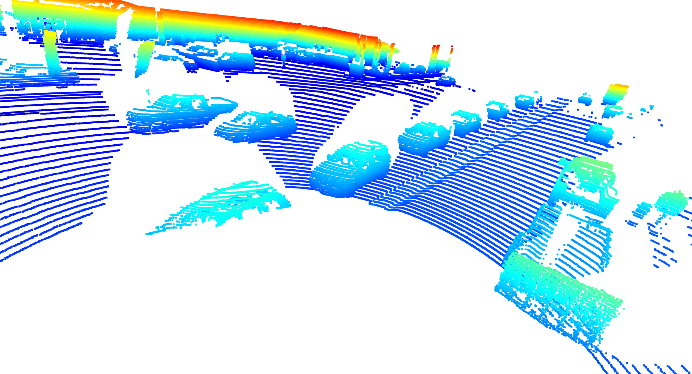
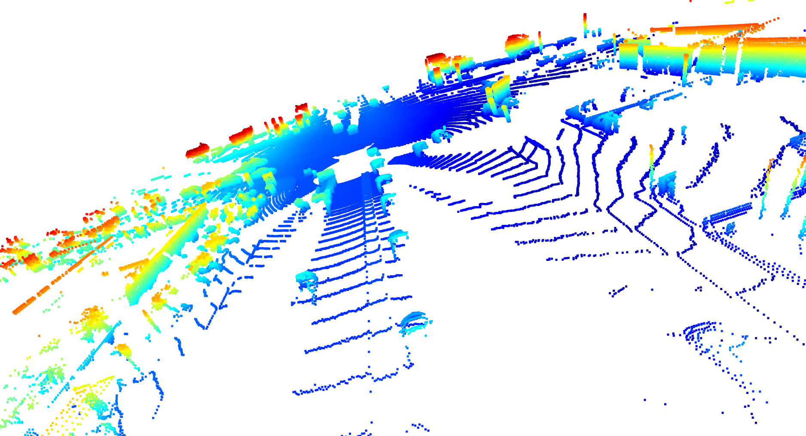
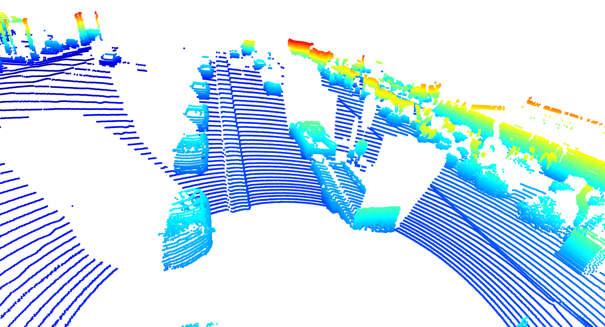
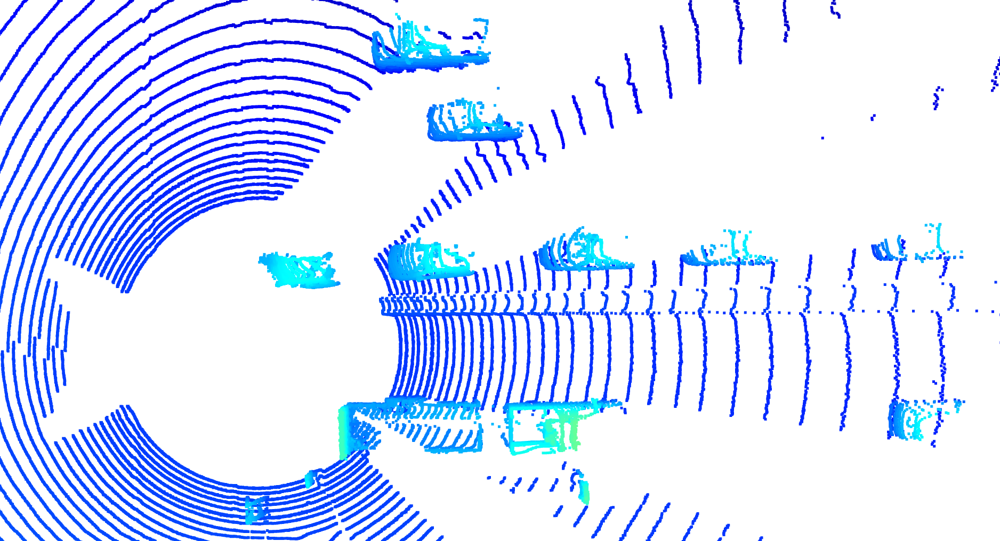
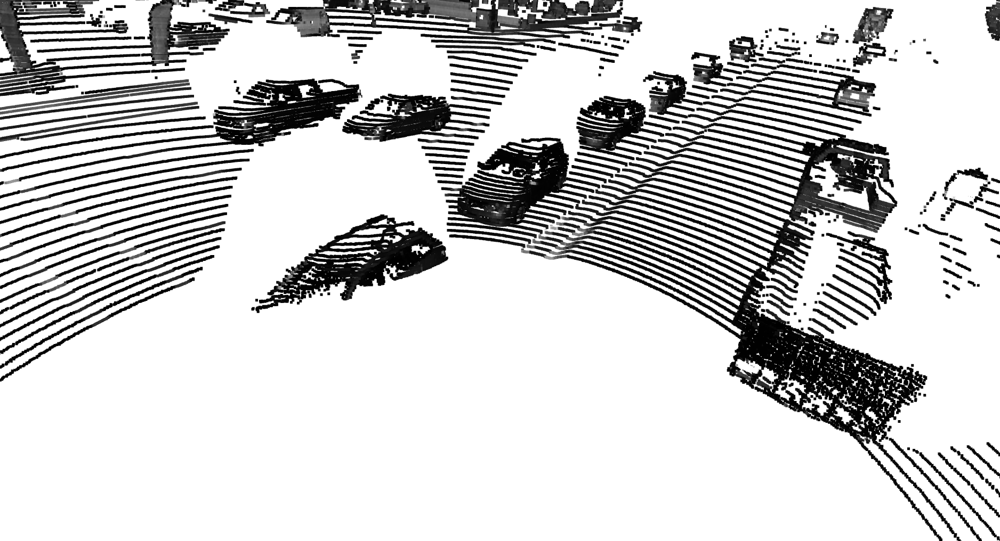
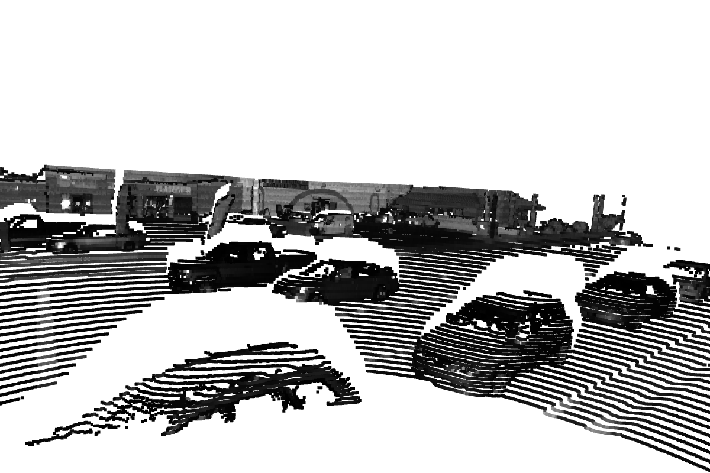
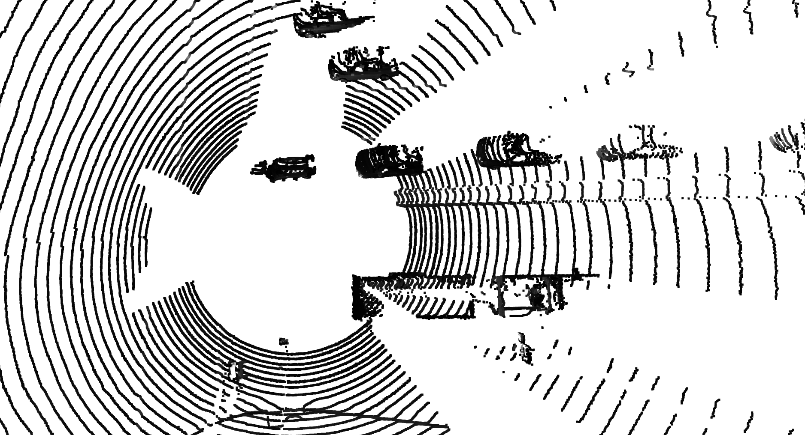
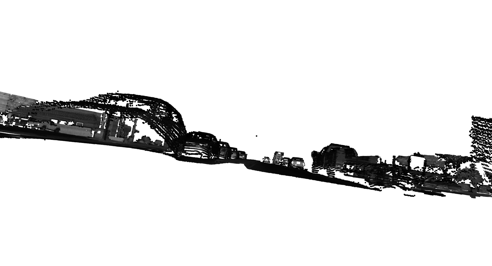
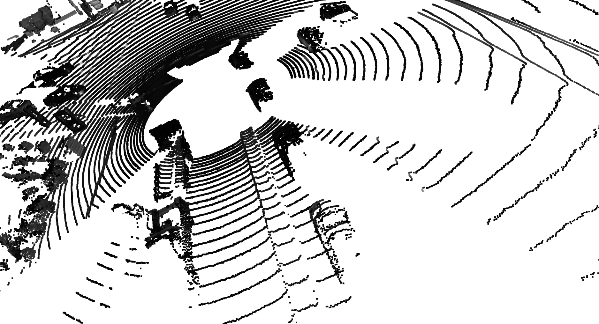
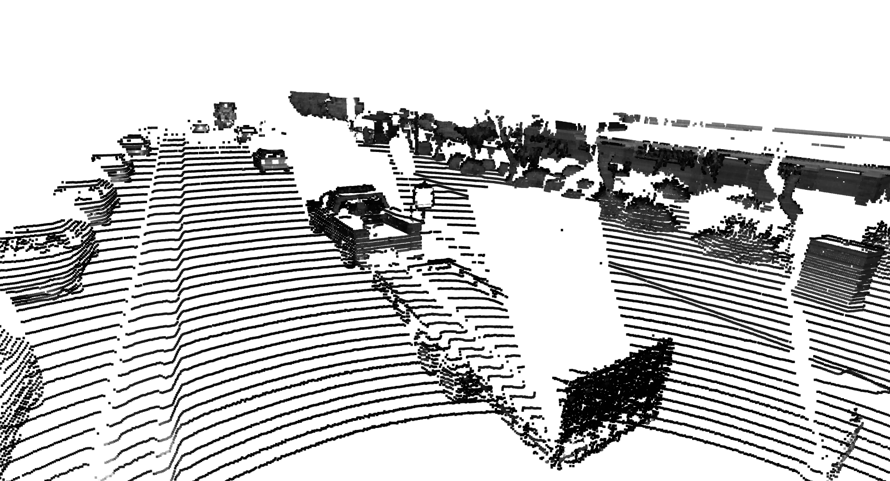

# ID_S1_EX2
## Point-Cloud Visualization
I have displayed views where the colour is indexed to altitude (blue for the lowest points - red for the highest points) and other views where the colour is indexed to the intensity of the reflected beam (black low intensity - white high intensity).
### Altitude

Depending on the location of the vehicle in relation to the lidar, the front and one side of the vehicle or the rear and the other side can be captured.
The tyres are present.
In this scene, where the density of objects is high, there are many hidden areas.

On the opposite side of the lidar, the vehicles are obviously not described at all.

On the roofs, the clouds are not very dense. 

The BEV highlights the poorly described areas.
### Intensity

Images involving intensity yield similar conclusions.

It should be noted that the intensity is sensitive to the nature of the surfaces (headlight lenses strongly reflect the laser) as well as the orientation of the surface.
At the corner of vehicles where the surfaces are normal to the laser beam, the reflected intensity is greater than on surfaces more tangential to the beam (side walls or roofs).

The headlights of the second vehicle on the left are clearly visible.

### Conclusion on stable elements
the front and rear bumpers, wheels, side walls, headlights seem to be the relatively stable objects.