# Point-Cloud Visualization
I have displayed views where the colour is indexed to altitude (blue for the lowest points - red for the highest points) and other views where the colour is indexed to the intensity of the reflected beam (black low intensity - white high intensity).
## Altitude
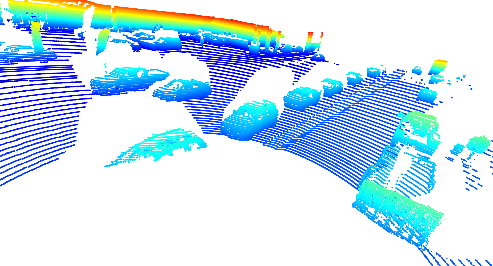
Depending on the location of the vehicle in relation to the lidar, the front and one side of the vehicle or the rear and the other side can be captured.
The tyres are present.
In this scene, where the density of objects is high, there are many hidden areas.
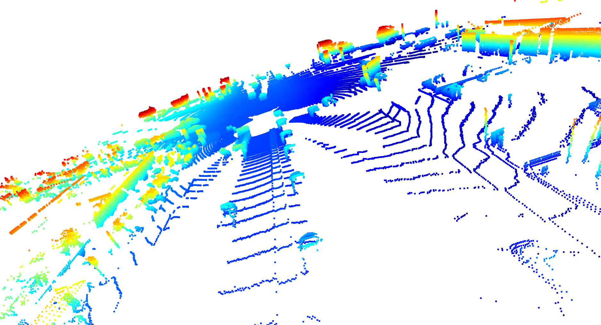
On the opposite side of the lidar, the vehicles are obviously not described at all.
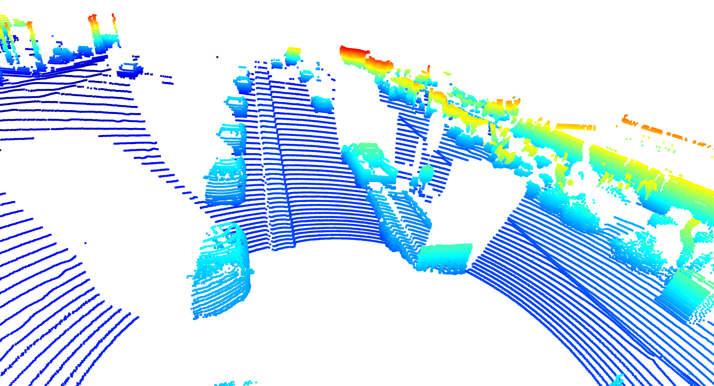

On the roofs, the clouds are not very dense. 
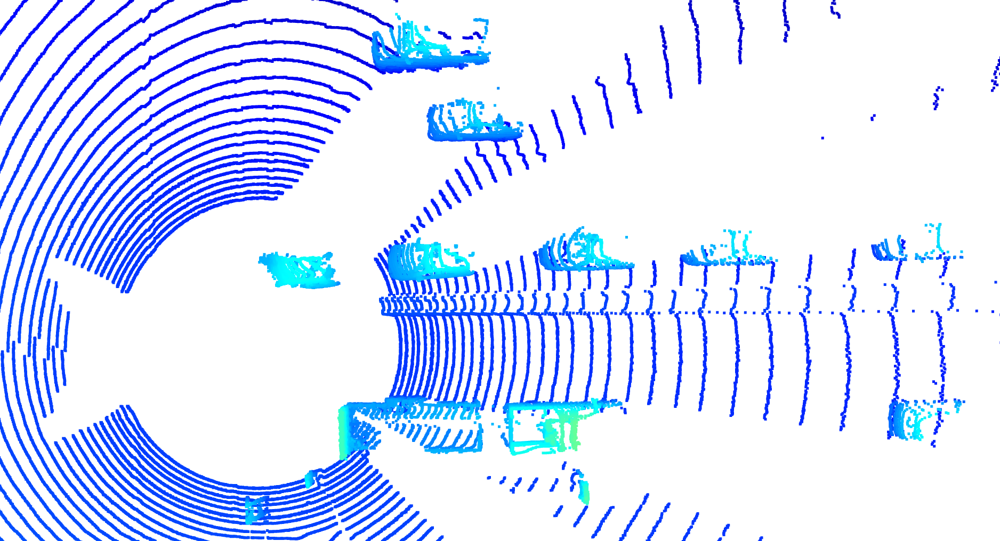
The BEV highlights the poorly described areas.
## Intensity
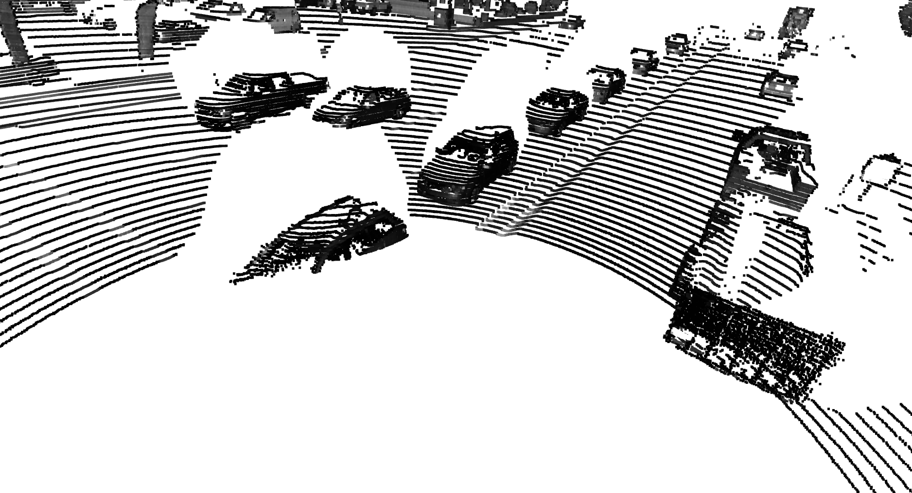
Images involving intensity yield similar conclusions.
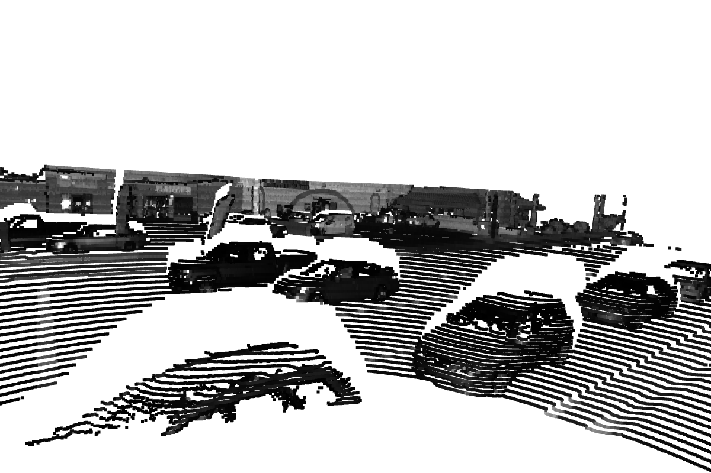
It should be noted that the intensity is sensitive to the nature of the surfaces (headlight lenses strongly reflect the laser) as well as the orientation of the surface.
At the corner of vehicles where the surfaces are normal to the laser beam, the reflected intensity is greater than on surfaces more tangential to the beam (side walls or roofs).
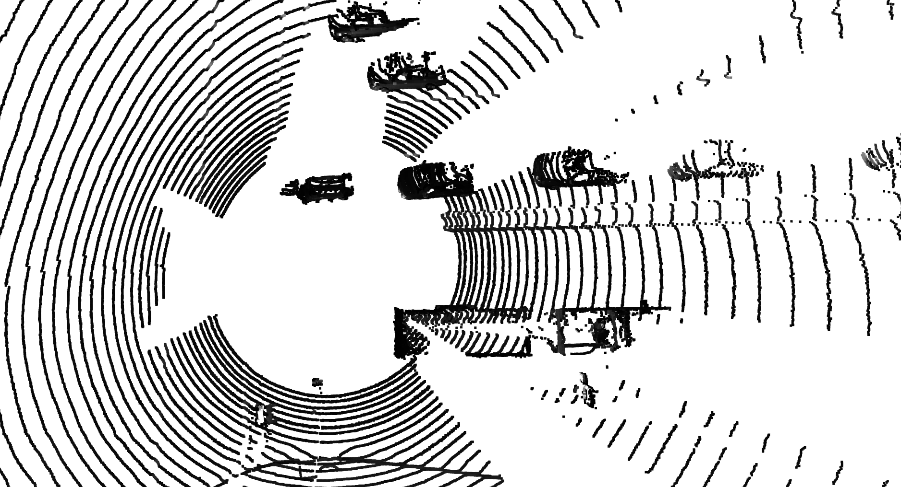
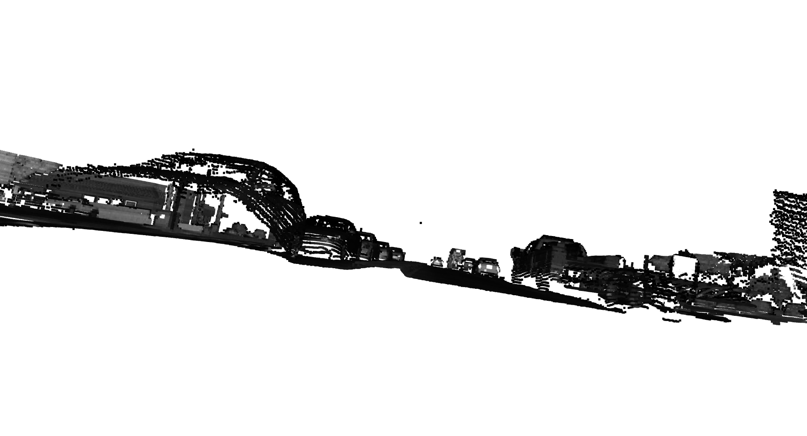
The headlights of the second vehicle on the left are clearly visible.
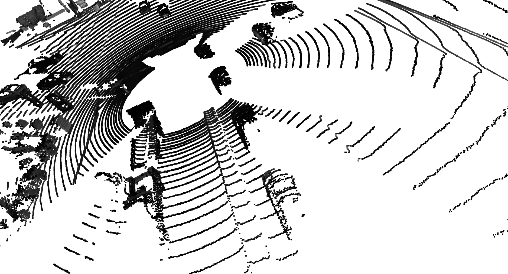
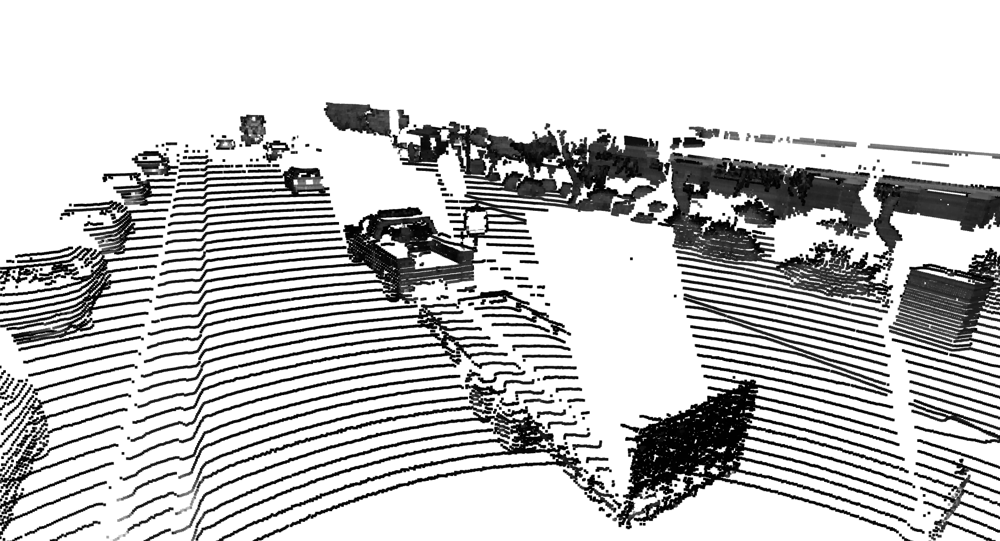
## Conclusion on stable elements
the front and rear bumpers, wheels, side walls, headlights seem to be the relatively stable objects.

# BEV
## Point-cloud
Changing the coordinates system from metric to BEV of the lidar point-cloud give the following result.
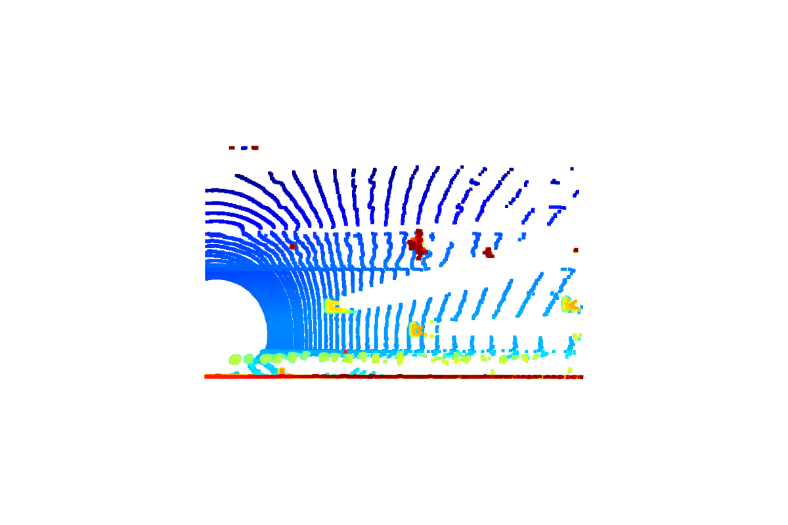

## Intensity map
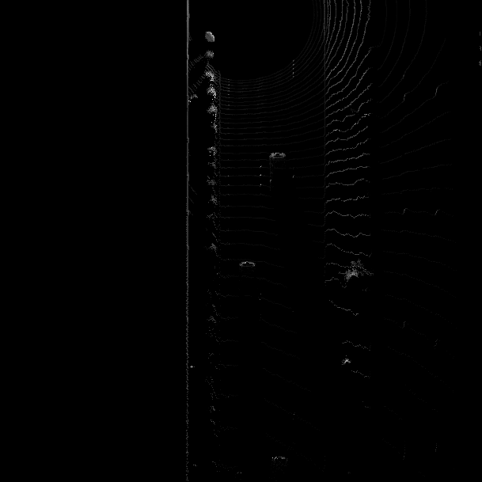

## Height map
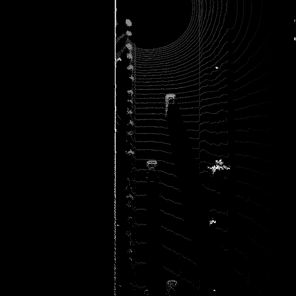

# Detections (BEV and camera images)
I have implemented the configuration suited for the 'fpn_reset' with the given example.
NOTA : Some of the helpers function are not properly documented.
Detection results are shown below :

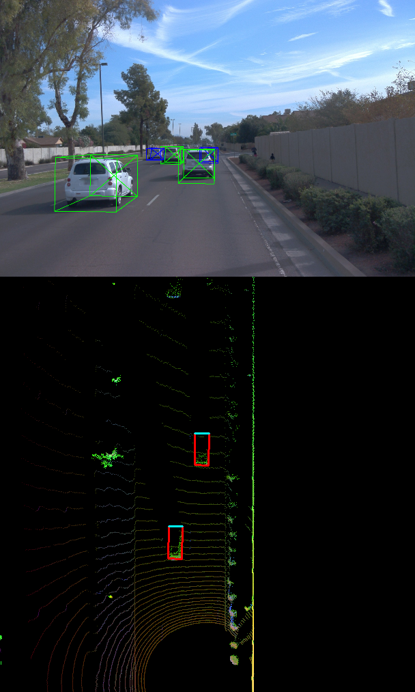
For this frame, the resnet fails to detect one car (on the top of the bird eye view image).

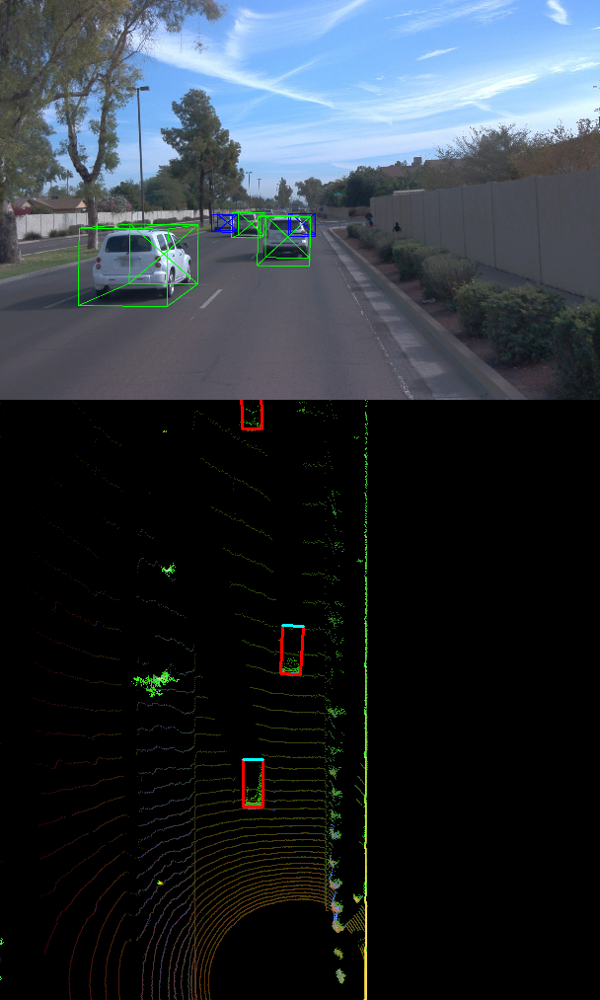
For the next frame, the resnet is abble to detect the 3 cars.

# IOU
Here are the ious given by YOLO on the first dataset for the frame 50 and 51.
```
[0.7799356669523799, 0.8843171827999533, 0.8728753477765835]
```
```
[0.7629893411201762, 0.8902383672272116, 0.8367249245351582]
```

# Performances
## with darknet detections
I did the performance evaluation with the darknet model on the first dataset between the frame 50 and 150.
With an iou threshold equal to 0.7, I get the results below.


```
precision = 0.9245901639344263, recall = 0.9215686274509803
```
## with labels (just for verification)
If I use the labels and not the darknet detections, the results are the following :

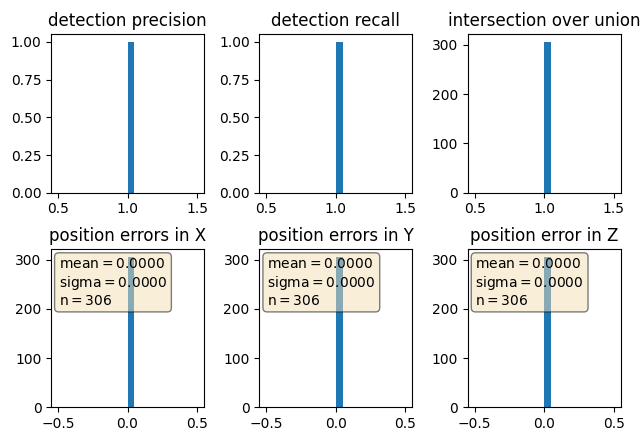
```
precision = 1.0, recall = 1.0
```
As expected, the precision and the recall are perfect (equal to 1.0). The distribution of the Intersection Over Union is perfect (only 1.0 values). Positionning error are null.

I did the same calculations with different iou threshold (0.5, 0.65, 0.8) and with the fpn_resnet. But I have not extracted images for those tests (because at that time, I thought that it was not mandatory to write up a report on this part of the project - please make the instructions clearer, and also reviewers comments clearer and aligned one with the other).